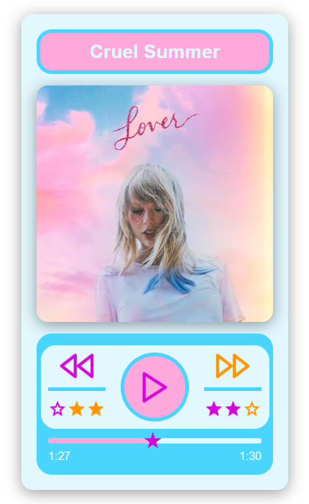

# Music Player 🎵

A lightweight music player built with [Electron](https://www.electronjs.org/).  
Play locally on your desktop — works on Windows, macOS, and Linux.

## 🌐 Live Demo

Check out the live site here: [https://bianca574.github.io/music_player/]

## 🛠️ Technologies Used

- HTML
- CSS
- JavaScript

## Features

- Transparent and customizable interface
- Play, pause, rewind, and fast forward buttons  
- Display of elapsed time and remaining time for each song  
- Progress bar to show song position and allow seeking  
- Frameless window with draggable header for easy movement  
- Lightweight and responsive Electron app

## 📦 Installation

First, clone this repository:

git clone https://github.com/bianca574/music_player.git

cd music_player

Then install dependencies:

npm install

🚀 Run in Development

npm start

This will open the app in an Electron window for development.

🛠 Build for Production

To create a distributable package:

npm run make

The output will be in the out/ or dist/ folder (depending on your config).

## 📄 License

This project is closed-source. All rights reserved.
